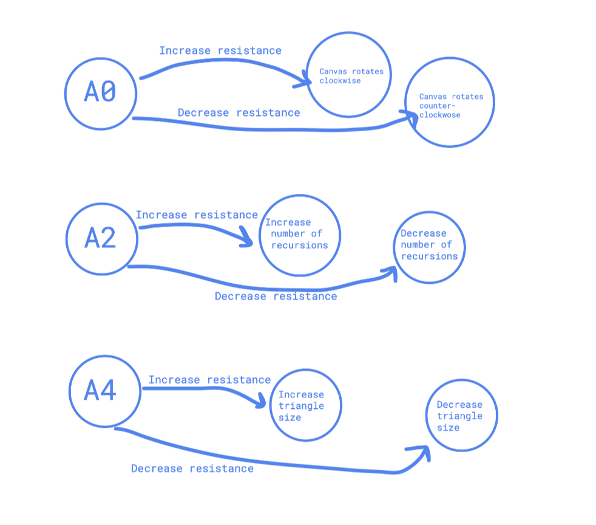
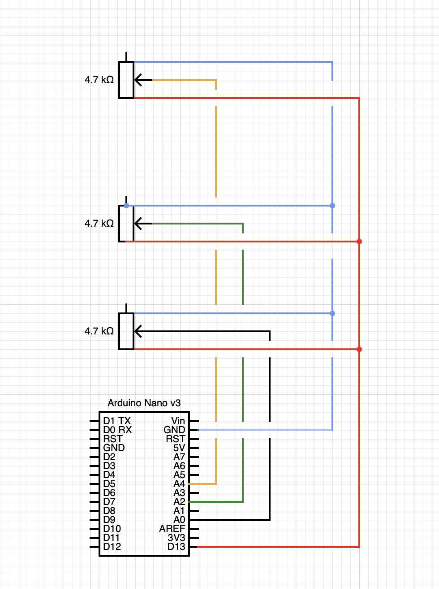
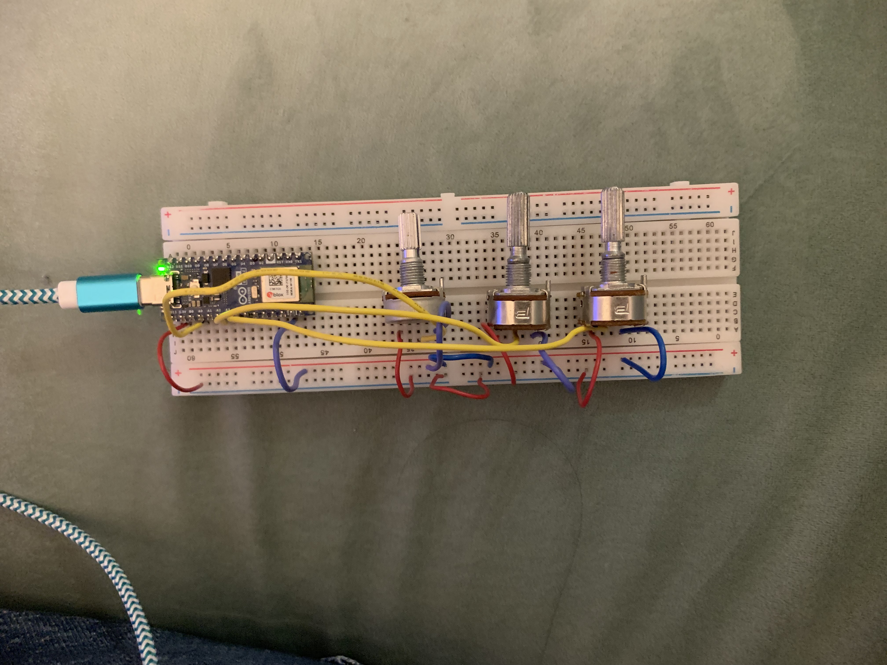

# Milestone 4 / Final
For the final version of this project, I changed my code in a few ways. The potentiometer at A0 originally controlled the shapeOrientation variable and rorated the triangle/canvas. I felt this was the least interesting and vital element of the code so I experimented with a few alternatives. I tried a tiling effect with multiple Sierpinski triangles mapped to the potentiometer value but it made the flickering effect kind of unbearable. I added framecount and some interpolation to try to address this but it was still too much (although both made the overall sketch much smoother!). 

Instead I decided to draw inspiration from some cool fabric I found online when googling "retro triangles" and have the potentiometer cycle through a fixed color palette on a black background. The final result is one triangle which the user can smoothly zoom in and out of, controlling the number of fractals within it as well as the color scheme. In keeping with the retro theme, I added the external p5.grain library to create a textured overlay although I think it's only visible when you're zoomed in to the triangle. 

The final mechanism consists of three potentiometers which control the color of the triangle, the level of recursion, and its size. The Arduino functions as the input and the sketch as the output. Below you can find my diagrams as well as some inspiration pictures. 

I had my roommate test the mechanism. She tried code with a few different frame rates and thought 30fps was not too jerky. She liked feeling like the code was responsive to her rotating the different knobs — actively being redrawn, which it is! 

Overall this was a fun project. The mathematical element of the code reminded me of some of our early discussions about algorithmic thinking and I feel that the fractals are evocative of our readings on early computer art. I also feel that I captured for myself the feelings that the original Vihart videos inspired in me as a kid; I can remember trying to draw the tiniest triangles possible and controlling the "zoom" (really the size) of the triangle and the number of inner triangles struck me as a similar exercise.

# Milestone 3
Working on this made my realize what problem I was having getting the serial port to work on HW13 so that was gratifying! I didn't have the library installed correctly in my index.html file I believe. I think the bones of my code are now in place: I can connect to the serial and control 3 variables of the Sierpinksi triangle with my potentiometers. However I think the variables are a little simple and for the final week of the project I plan to see if I can make them more interesting as well as use an additional P5JS library to add some cool colors or patterns. 

# Milestone 2
I’ve decided to pursue option 3 for my final project: creating a generative fractal drawing, which uses knobs to change certain parameters and influence the drawing. I did some initial research on fractals and plan for the base drawing to be a [Sierpinski Triangle](https://en.wikipedia.org/wiki/Sierpiński_triangle). This is one of the shapes discussed in the Vihart videos that initially inspired my project. I found these videos really captivating as a kid and I like the idea of recreating them in a way that allows the user to have direct control over the inputs, similar to what they'd have while drawing but with an immediate visual connection between input and output. 

From my research I think this is a good choice because it’s a relatively simple piece of code (though I think I will have to use a recursion) to which I can incorporate the more difficult element, the superformula. The superformula will add various parameters which can be mapped to the physical input of the Arduino and will allow the user to change what is being drawn. 

In terms of sensors to use, I think I could do this with 2-3 potentiometers—I like the idea of using something with a continuous range of inputs rather than a binary on/off since that allows for more playing with the parameters. When I was looking into sensors the other option that came up was using a rotary encoder. My understanding of the difference between the two is that a rotary encoder allows for discrete incrementation with no upper limit on rotation. I will check out the design lab and maker space to see what sensors are available as well. I should be able to get 3-5 people to do user testing with the code. 

In terms of external libraries I think I would like to explore some of the [p5js drawing libraries](https://p5js.org/libraries/directory/#drawing) to add some visual interest to the code, for example [this one](https://github.com/SYM380/p5.pattern) that creates fill patterns. Another one that may be helpful is [p5.polar](https://github.com/liz-peng/p5.Polar) which creates symmetrical geometric patterns. 

# Milestone 1

## Option 1: 
An idea I had when we did the clock homework was to create some code based on this [“A Perfectly Useless Afternoon” watch](https://mrjoneswatches.com/products/a-perfectly-useless-afternoon), where the hands do point to a time but in a pretty illegible way. I think it’s charming and since my previous clock didn’t actually map onto a clock face it could be fun to toy around with. I’m not sure how to incorporate a physical computing element—maybe sound triggered by a button? 

## Option 2a & 2b:
Another idea was to create something similar to our midterm project but with an additional physical computing element. I’d toyed with several ideas for the midterm such as recreating the Macrodata Refinement software from the show Severance, which is about a fictional corporation called Lumon Industries which creates a technology to split employees into work and non-work selves. The employees in the show work on sorting numbers (based on how scary the numbers feel!) and I could reproduce this via code with a physical button to “box” the numbers (pictured). 

I also thought about doing something based on the alien/horror film Nope which involves themes of spectacle. Perhaps an animation that uses the ml5.js library to run or not run (perhaps the UFO getting closer or further away) depending on if your eyes are looking at the screen? Again I’m not as sure about the Arduino component… I would love your thoughts on this because I feel like I don’t totally have a sense of what is possible with the Arduino yet. One thing that happens in Nope is that the electricity dies when the UFO is close and that seems like it could be similarly replicated. 

Both of these concepts appeal to me in part because they are pieces of media with both strong visual asthetics and themes and the idea of coding within that feels fun. 

## Option 3: 
Earlier in the semester I wrote about this a YouTuber I liked when I was in elementary and middle school called ViHart who considered themself a “mathemusician” and whose doodles seem fun to create in code. I used to draw their [infinity doodles](https://www.youtube.com/watch?v=DK5Z709J2eo) a lot but they have lots of things like Fibonacci spirals and fractals that I think could be interesting. I could use a button or a rotary encoder to change the parameters of the fractal patterns or spirals, or add more circles and zoom to explore the image being produced 

